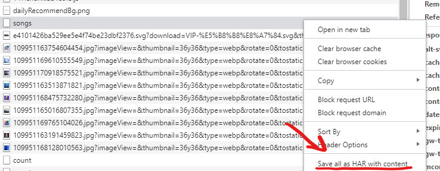

# HyplayerCookieFetch

Convert dumped data to HyPlayer's format.

# Usage

1. Open NeteaseCloudMusic's DevTools ([if you can](https://github.com/std-microblock/BetterNCM)) and click "Save all as HAR with content" in "Network" tab
   
2. run

```bash
deno --allow-read ./main.ts --har=<your .har file here>
```

3. if everything is right and console outputs a json, paste it into HyPlayer.
